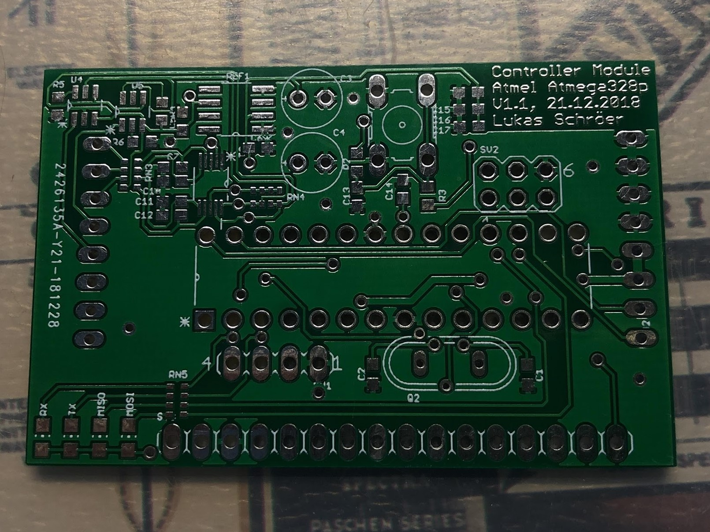
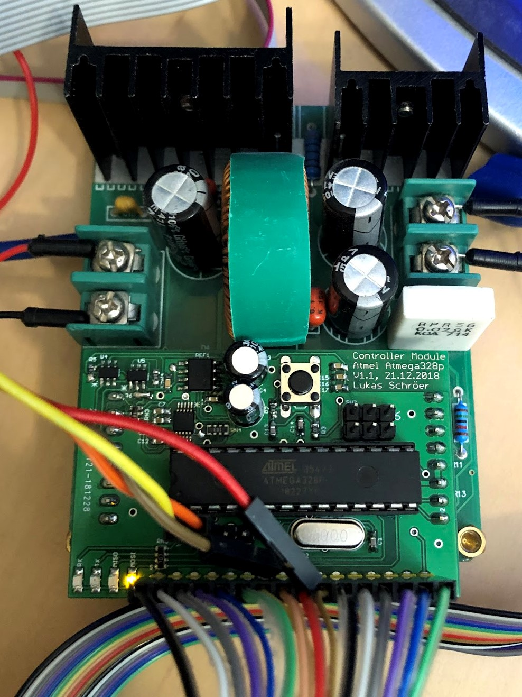
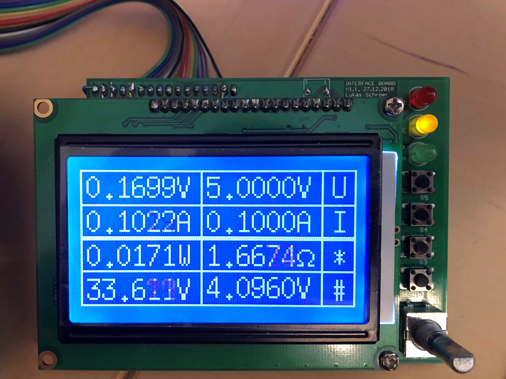

# Atmel atmega 328p DCDC controller
Arduino Uno Project for digitally controlling DCDC converter with adc & dac over i2c with dotmatrix display.
Utilizes the cheap B3606 analog DCDC converter circuit.

The onboard 4.096V reference in combination with 2 12bit DACs as well as one 4 Channel 16bit ADC enable accurate voltage and current setpoints. 

The graphical interface also features a graph display, showing voltage and current over time.

